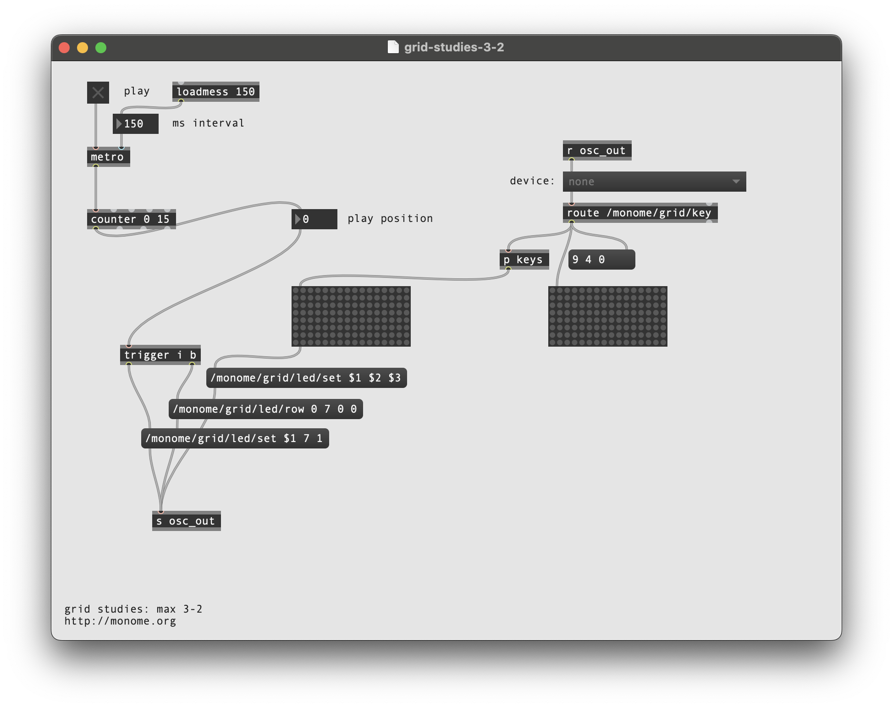
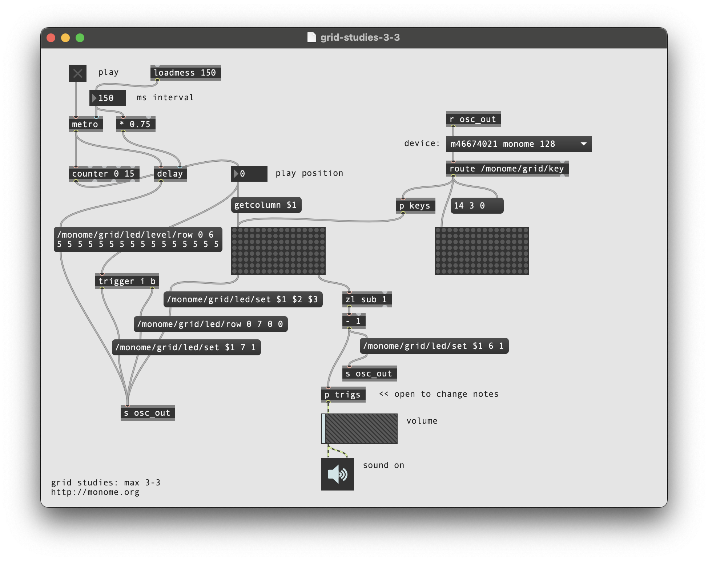

# Grid Studies: Max

By design the monome grid does nothing on its own. You the user assign it purpose and meaning: instrument, experiment, tool, toy... choose your own adventure. This grid is *intended* to be reimagined. Here we set forth to impart some introductory knowledge: potential energy for radical creative freedom.

Max is a full kit of creative tools for sound, graphics, music and interactivity in a visual environment. Patching together *objects* the user can create complex interactions between software and hardware devices. The rapid and immediate nature of graphical programming lends itself well to developing for grids, making it the longtime tool of choice for monome grid-based software.

This tutorial will show the basics of interfacing with the grid including how a simple, yet immediate sequencer platform can be made with a small amount of code.

## Prerequisites

This lesson assumes a basic understanding of the Max patching interface. If you're absolutely new to Max it may be helpful to first go through some of the most excellent Max tutorials in-app `Help > Max Documentation`.

Download Max 7: [cycling74.com/downloads](https://cycling74.com/downloads/)

Download the monome installer: [monome.org/docs/begin](http://monome.org/docs/begin)

Download the code examples here: [files/grid-studies-max.zip](files/grid-studies-max.zip)

## 1. Connect

*See grid-studies-1-1.maxpat for this section.*

To communicate with grids we trade OSC messages with serialosc. serialosc translates OSC messages to streams of numbers over USB.

First we will show how to talk to serialosc.

Open Max and start a new patcher.

Create a new object (press N) and type `bpatcher serialosc` and then hit enter. A bpatcher window will appear, resize this to match the long rectangle.

Plug in your grid and it will appear in the serialosc box. If you connect more than one grid, you can choose which device to communicate with via the dropdown.

Note: this box you've embedded isn't serialosc itself, which is an invisible daemon on your computer. This box is a helper patcher to simplify using serialosc. We'll refer to this helper as serialosc, hopefully without much confusion.

## 2. Basics

Messages are sent to serialosc through the top left inlet, and received out the bottom left outlet.

*See grid-studies-2-1.maxpat for this section.*

### 2.1 Key input

To see what is coming from the grid, create a `print` object and connect the left outlet of serialosc to it. Open the max console (Window -> Max Console) and press some keys on the grid. OSC data will be displayed on the console.

Examining the output, key data fits this form:

	/monome/grid/key x y z

Where x,y is the position and z indicates key down (1) or key up (0). Note here that x,y position is 'zero referenced' so 0,0 is the upper-left key and 15,7 is the lower-right.

Other messages (such as connect and disconnect) come from this same outlet, so we want to filter for the key messages.

Change the `print` object to `route /monome/grid/key` and then see the output from the route.

We now have a list of 3 numbers according to each key action. Use an unpack to break this down further into individual numbers.

Create a 16x8 matrixctrl object by typing:

	matrixctrl @columns 16 @rows 8

Connect the output of the route to this `matrixctrl` for a graphical display of the grid's key state.

### 2.2 LED output

Above the serialosc box create a message (push M) and type:

	/monome/grid/led/set 2 0 1

Connect this to the left inlet of serialosc.

Clicking this box will light up LED 2 in row 0. The message format is:

	/monome/grid/led/set x y z

This is similar to the key input message, where z is on (1) or off (0).

Using Max's list methods, use `$1 $2 $3` to change LEDs more dynamically. With a single message box as a sort of funnel, we can change various positions with message boxes, toggles, and a `matrixctrl`.

To clear the entire grid, use the following message:

	/monome/grid/led/all 0

### 2.3 Coupled interaction

Connect the output of

	route /monome/grid/key

to the `matrixctrl` which above serialosc which changes LEDs.

You now have a coupled interface, where the key state is reflected by the the LEDs.

### 2.4 Decoupled interaction

The most fundamental decoupled interface is an array of toggles. We can accomplish this easily by ignoring the key up state, switching the LED state only on key down.

Remove the connection to the LED-driving `matrixctrl`. We can filter out key-up messages by re-arranging the order of the key output, using a route object:

	$3 $1 $2

	route 1

By moving the key state (z, here as `$3`) to the front, the route object will only pass messages where this first number is equal to 1. What comes out of route is just x and y. We can use this to toggle a matrixctrl by adding `inc` to the end of the message thusly:

	$1 $2 inc

Connect this to the input of the `matrixctrl` and we have a toggle bank.

## 3.0 Further

Now we'll show how basic grid applications are developed by creating a step sequencer. We will add features incrementally:

- Use the top six rows as toggles.
- Accept a clock pulse to advance the playhead from left to right, one column at a time. Wrap back to 0 at the end.
- Display the play head on "position" (last) row.
- Indicate the "activity" row (second to last) with a low brightness.
- Trigger an event when the playhead reads an "on" toggle. Our "event" will be to turn on the corresponding LED in the "activity" row.
- Jump to playback position when key pressed in the position row.
- Adjust playback loop with two-key gesture in position row.

### 3.1 Toggles

*See grid-studies-3-1.maxpat for this step.*

This works identically to our previous "decoupled interaction" example, but we want to only use the first six rows. So we sort them out inside the /p keys/ subpatcher:

	$2 $1 $3

	route 6 7

By switching the first and second elements and then putting them into the route object, rows 0-5 are passed to the right outlet. We'll then pass key-down messages only to the matrix toggling.

### 3.2 Play

*See grid-studies-3-2.maxpat for this step.*

We can create a "play head" with a simple counter.

To see the play position on the bottom row, we will turn on the corresponding LED position after first clearing the entire row. We can clear a row by using a new OSC message:

	/monome/grid/led/row 0 7 0 0

where the format of the message is:

	/monome/grid/led/row x_offset y d[...]

Here y is 7, the last row. Check out the full OSC spec for more information on this message.

After we clear the row, we turn on the corresponding LED with a normal single-LED message:

	/monome/grid/led/set $1 7 1

Now when you turn on the clock, you'll see the playhead moving along the bottom row.

### 3.3 Triggers

*See grid-studies-3-3.maxpat for this step.*

As the playhead moves we will read the contents of the corresponding column and trigger events based on which toggles are turned on.

We do this by connecting a `getcolumn $1` to the toggle matrix, driven by the play position. The matrix will output a list of 0/1 values which indicate the toggle states from top to bottom. We can "extract" only the 1's (on-states) using a `zl sub 1` object. However, these values are indexed from 1, and we need them indexed from 0 (because this is how the grid indexes its LEDs) so we subtract one.

To indicate an "event" we will light up the corresponding x position in the 6th row:

	/monome/grid/led/set $1 6 1

Similarly to the play position display, we need to clear the row between refreshes. But since more than one event can be displayed per step, we'll want to clear only once per group of triggers. We can accomplish the desired visual effect by clearing the row a delayed time after the events arrive.

Furthermore, to give the interface some delineation (not just a field of random LEDs) we will "clear" this row to a low-brightness level rather than completely off:

	/monome/grid/led/level/row 0 6 5 5 5 5 5 5 5 5 5 5 5 5 5 5 5 5

This /level/ message is in the format:

	/monome/grid/led/level/row x_off y d[...]

The format is similar to the monochromatic `row` message, but here `d[...]` is discrete LED values of 0-15. The message we're using has 16 of the number 5, which sets the entire 6th row to a dim level.

The "triggered" LEDs will be full brightness on top of this dim row.

Lastly, there's a tiny sound engine so you can actually hear something. Turn on the DAC and turn up the gain slider. Change the note values by opening up the `p trigs` subpatcher.

### 3.4 Cutting and Looping

*See grid-studies-3-4.maxpat for this step.*

To liven up the sequencer, we will have key presses on the play row jump to the pressed position. But we also want a two-key gesture (holding down a first while pressing a second) to set the start-end loop boundaries. This requires keeping track of how many keys are being held down in the last row.

First we add the `r counter` receive object above the counter. Then the rest of the patching happens inside the `p key` subpatcher.

We unpack the incoming message and keep track of the accumulation of key ups and downs. This is accomplished by adding one for each key up and subtracting one for each key down. This looks weird as a Max patch, but tracing through it will reveal the logic.

The number of keys held will gate the output of the x position of the key. When a single key is pressed the x position goes out the left outlet of the gate, setting the position of the counter. This first position is also stored for potential use later.

If a second key is pressed (in this same row) while a first is held, the current x position pressed is set as the loop max (with a `max $1` message) and the previously pressed x position is recalled and set as the loop minimum (with a `setmin $1` message).

## Closing

We've created a minimal yet intuitive interface for rapidly exploring sequences. We can intuitively change event triggers, loop points, and jump around the data performatively. Many more features could be added, and there are numerous other ways to think about interaction between key press and light feedback in completely different contexts.

### Suggested exercises

- Display the loop range with dim LED levels.
- "Record" keypresses in the "trigger" row to the toggle matrix.
- Display the play head position as a dim column behind the toggle data.
- Use the rightmost key in the "trigger" row as an "alt" key.
	- If "alt" is held while pressing a toggle, clear the entire row.
	- If "alt" is held while pressing the play row, reverse the direction of play.

### Bonus

See grid-studies-3-5.maxpat for a js implementation of this patch.

## Credits

*Max* was originally designed by Miller Puckette and is actively developed by [Cycling '74](http://cycling74.com).

This tutorial was created by [Brian Crabtree](http://nnnnnnnn.org) for [monome.org](monome.org).

Contributions welcome. Submit a pull request to [github.com/monome/grid-studies-max](https://github.com/monome/grid-studies-max) or e-mail [info@monome.org](mailto:info@monome.org).